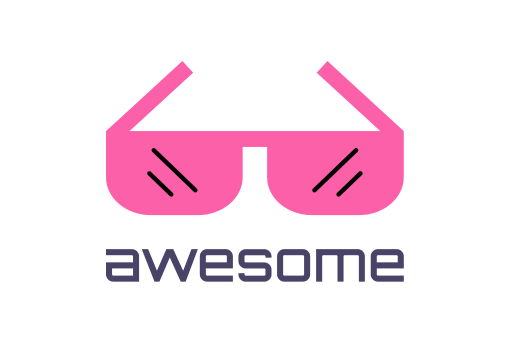
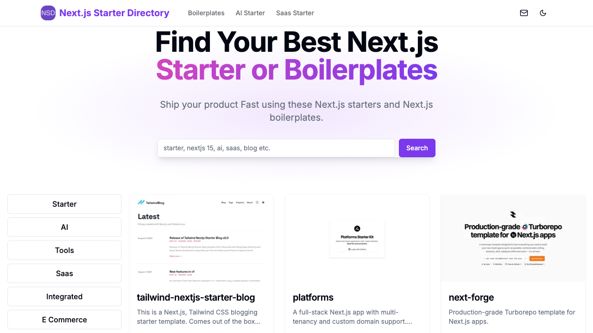

    
  

  <h1>Awesome Next.js</h1>
   A curated list of awesome things related to <a href='https://nextjs.org/'>Next.js</a>
  

## Starter

- [Tailwind Nextjs Starter Blog](https://github.com/timlrx/tailwind-nextjs-starter-blog) - This is a Next.js, Tailwind CSS blogging starter template. Comes out of the box configured with the latest technologies to make technical writing a breeze. Easily configurable and customizable. Perfect as a replacement to existing Jekyll and Hugo individual blogs.
- [Platforms](https://github.com/vercel/platforms) - A full-stack Next.js app with multi-tenancy and custom domain support. Built with Next.js App Router and the Vercel Domains API.
- [Next Forge](https://github.com/haydenbleasel/next-forge) - Production-grade Turborepo template for Next.js apps.
- [Fragments](https://github.com/e2b-dev/fragments) - Open-source Next.js template for building apps that are fully generated by AI.
- [TS Nextjs Tailwind Starter](https://github.com/theodorusclarence/ts-nextjs-tailwind-starter) - Next.js + Tailwind CSS + TypeScript starter and boilerplate packed with useful development features.
- [Next Shadcn Dashboard Starter](https://github.com/Kiranism/next-shadcn-dashboard-starter) - Admin Dashboard Starter with Nextjs14 and shadcn ui
- [Virtual Event Starter Kit](https://github.com/vercel/virtual-event-starter-kit) - Open source demo that Next.js developers can clone, deploy, and fully customize for events.
- [Breeze Next](https://github.com/laravel/breeze-next) - An application / authentication starter kit frontend in Next.js for Laravel Breeze.
- [Langchain Nextjs Template](https://github.com/langchain-ai/langchain-nextjs-template) - LangChain + Next.js starter template
- [Next Wordpress Starter](https://github.com/colbyfayock/next-wordpress-starter) - Bring WordPress to the static world with Next.js.
- [Nextjs Starter Kit](https://github.com/michaelshimeles/nextjs-starter-kit) - The Ulimate Nextjs Starter Kit. Build your next SAAS product of your dreams. Batteries included.
- [Chadnext](https://github.com/moinulmoin/chadnext) - Quick Starter Template for your Next project includes Next.js 14 App router, Shadcn UI, LuciaAuth, Prisma, Server Actions, Stripe, Internationalization and more.
- [Nextjs Postgres Auth Starter](https://github.com/vercel/nextjs-postgres-auth-starter) - Next.js + Tailwind + Typescript + Drizzle + NextAuth + PostgreSQL starter template.
- [Landing Page Boilerplate](https://github.com/weijunext/landing-page-boilerplate) - A versatile landing page boilerplate, ideal for various projects and marketing campaigns.
- [Nextjs Wordpress Starter](https://github.com/WebDevStudios/nextjs-wordpress-starter) - A headless starter for WordPress powered by Next.js.
- [Next Wp](https://github.com/9d8dev/next-wp) - Headless Wordpress Starter built with the NextJS App Router and React Server Components.
- [Next Drupal](https://github.com/chapter-three/next-drupal) - Next.js for Drupal has everything you need to build a next-generation front-end for your Drupal site: SSG, SSR, and ISR, Multi-site, Authentication, Webforms, Search API, I18n and Preview mode.
- [Next Starter](https://github.com/Skolaczk/next-starter) - A Next.js starter template, packed with features like TypeScript, Tailwind CSS, Next-auth, Eslint, Stripe, testing tools and more. Jumpstart your project with efficiency and style.
- [Cult Directory Template](https://github.com/nolly-studio/cult-directory-template) - A full stack Next.js, Shadcn, and Supabase directory template. Build your startup directory effortlessly with features like user authentication, product filters, and customizable themes. Advanced admin perks and AI magic.
- [Nextjs Starter](https://github.com/once-ui-system/nextjs-starter) - Design like a pro and ship like a madman with Once UI.
- [Hume Evi Next Js Starter](https://github.com/HumeAI/hume-evi-next-js-starter) - This project features a sample implementation of Hume's Empathic Voice Interface using Hume's React SDK.
- [Tina Cloud Starter](https://github.com/tinacms/tina-cloud-starter) - Next.js starter for TinaCMS: live edit your website visually.
- [T3 App Template](https://github.com/gaofubin/t3-app-template) - This is the admin template for T3 Stack and shadcn ui.
- [Mendable Nextjs Chatbot](https://github.com/mendableai/mendable-nextjs-chatbot) - Next.js Starter Template for building chatbots with Mendable.
- [AI Fusion Kit](https://github.com/nphivu414/ai-fusion-kit) - A feature-rich, highly customizable AI Web App Template, empowered by Next.js.
- [Onyx](https://github.com/rmourey26/onyx) - Onyx is a turnkey, full stack NextJS 14+ web app written in Typescript that includes role based access control (RBAC), complete Supabase SSR Auth and DB integration, Zod and YUP!
- [Nextjs Starter](https://github.com/chhpt/nextjs-starter) - A TypeScript starter for Next.js that includes all you need to build amazing projects.
- [Modelfusion Ollama Nextjs Starter](https://github.com/lgrammel/modelfusion-ollama-nextjs-starter) - Starter examples for using Next.js and the Vercel AI SDK with Ollama and ModelFusion.
- [Supa Next Shad Auth](https://github.com/Sahil-Sharma-23/supa-next-shad-auth) - Next.js + Supabase Auth starter template with shadcn-UI and Tailwind CSS.
- [Nextjs Starter Kit](https://github.com/datocms/nextjs-starter-kit) - This project aims to be a great starting point for your Next.js projects that need to interact with DatoCMS.

## AI

- [RoomGPT](https://github.com/Nutlope/roomGPT) - Upload a photo of your room to generate your dream room with AI.
- [AI Chatbot](https://github.com/vercel/ai-chatbot) - A full-featured, hackable Next.js AI chatbot built by Vercel.
- [Llm Answer Engine](https://github.com/developersdigest/llm-answer-engine) - Build a Perplexity-Inspired Answer Engine Using Next.js, Groq, Llama-3, Langchain, OpenAI, Upstash, Brave & Serper.
- [RestorePhotos](https://github.com/Nutlope/restorePhotos) - Restoring old and blurry face photos with AI.
- [NotesGPT](https://github.com/Nutlope/notesGPT) - Record voice notes & transcribe, summarize, and get tasks.
- [Twitterbio](https://github.com/Nutlope/twitterbio) - Generate your Twitter bio with AI
- [Llamatutor](https://github.com/Nutlope/llamatutor) - An AI personal tutor built with Llama 3.1.
- [Logocreator](https://github.com/Nutlope/logocreator) - A free + OSS logo generator powered by Flux on Together AI
- [Readpilot](https://github.com/index-labs/readpilot) - Read Pilot analyzes online articles and generate Q&A cards for you. Powered by OpenAI & Next.js.
- [Pdftochat](https://github.com/Nutlope/pdftochat) - Chat with your PDFs with AI.
- [Extrapolate](https://github.com/steven-tey/extrapolate) - Age transformation AI app powered by Next.js, Vercel, Replicate, Upstash, and Cloudflare R2 + Workers.
- [Blinkshot](https://github.com/Nutlope/blinkshot) - A realtime AI image generator.
- [Gen UI](https://github.com/bracesproul/gen-ui) - Generative UI web application built with LangChain.js, AI SDK & Next.js.
- [Gpt Instagram](https://github.com/MODSetter/gpt-instagram) - A GPT-based autonomous multi-agent AI in Next.js that research & recommends Instagram Viral Posts reflecting your personality.
- [DiscovAI Search](https://github.com/DiscovAI/DiscovAI-search) - An AI-powered search engine for AI tools and custom data. Built with Next.js, OpenAI, Supabase, and more.
- [Pdf Chat AI](https://github.com/rajeshdavidbabu/pdf-chat-ai) - An AI powered Next.js app to chat with your PDF files and get a streamed response using Langchain and PineconeDB.
- [AI Chatbot Supabase](https://github.com/nolly-studio/ai-chatbot-supabase) - A full-featured, hackable Next.js x Supabase AI chatbot. Fork of the original built by Vercel.
- [Micro Scale](https://github.com/adevinwild/micro-scale) - Use this open-source image upscaling web app template for your Next.js project. Powered by Replicate AI.
- [Travel Planner AI](https://github.com/hardikverma22/travel-planner-ai) - AI travel planner leveraging Next.js, Convex, Clerk, Resend and OpenAI APIs for natural language interactions.
- [Llamaindex Chatbot](https://github.com/togethercomputer/llamaindex-chatbot) - A RAG Chatbot with Next.js, Together.ai and Llama Index.
- [AI Blog Post Generator](https://github.com/batuhanbilginn/ai-blog-post-generator) - An AI blog post generator with Next.js 13, Jotai and Framer Motion.
- [Chord Seq AI App](https://github.com/PetrIvan/chord-seq-ai-app) - AI-powered chord progression suggester built with Next.js for composers and music enthusiasts.
- [AI Content](https://github.com/nooqta/ai-content) - An AI Power content generator based on Next.js starter for Contentlayer that includes Tailwind CSS, MDX, and TypeScript.
- [DocMind](https://github.com/PiotrWarzachowski/DocMind) - Open source AI pdf summary maker as next.js app.
- [Nextjs Image Editor](https://github.com/Reflow-HQ/nextjs-image-editor) - AI image editor app built with Next.js and DALL-E.

## SaaS

- [Taxonomy](https://github.com/shadcn-ui/taxonomy) - An open source application built using the new router, server components and everything new in Next.js 13.
- [Nextjs Subscription Payments](https://github.com/vercel/nextjs-subscription-payments) - Clone, deploy, and fully customize a SaaS subscription application with Next.js.
- [Next Enterprise](https://github.com/Blazity/next-enterprise) - An enterprise-grade Next.js boilerplate for high-performance, maintainable apps.
- [Next Saas Starter](https://github.com/leerob/next-saas-starter) - Get started quickly with Next.js, Postgres, Stripe, and shadcn/ui.
- [Saas Boilerplate](https://github.com/ixartz/SaaS-Boilerplate) - Built with Next.js and Tailwind CSS, and the modular UI components of Shadcn UI. This Next.js SaaS Template helps you to quickly build and launch SaaS with minimal effort.
- [Saas Starter Kit](https://github.com/boxyhq/saas-starter-kit) - Enterprise SaaS Starter Kit - Kickstart your enterprise app development with the Next.js SaaS boilerplate.
- [Cloudflare Saas Stack](https://github.com/Dhravya/cloudflare-saas-stack) - An opinionated, batteries-included starter kit for quickly building and deploying SaaS products on Cloudflare. This is a Next.js project bootstrapped with c3.
- [Saasfly](https://github.com/saasfly/saasfly) - An easy-to-use and enterprise-grade Next.js boilerplate.
- [Next Saas Stripe Starter](https://github.com/mickasmt/next-saas-stripe-starter) - Open-source SaaS Starter with User Roles & Admin Panel. Built using Next.js 14, Prisma, Neon, Auth.js v5, Resend, React Email, Shadcn/ui, Stripe, Server Actions.
- [AI SaaS App](https://github.com/adrianhajdin/ai_saas_app) - Build a REAL Software-as-a-Service app with AI features and payments & credits system that you might even turn into a side income or business idea using Next.js 14, Clerk, MongoDB, Cloudinary AI, and Stripe.
- [Rapidlaunch](https://github.com/alifarooq9/rapidlaunch) - Beautiful Next.js SaaS Starterkits, Blocks and guides. Built using Shadcn ui, Next.js 14, DrizzleORM, Resend, and more.
- [Shadcn Nextjs Boilerplate](https://github.com/horizon-ui/shadcn-nextjs-boilerplate) - Shadcn UI NextJS Boilerplate , Free Open-source ChatGPT UI Admin Dashboard Template.
- [Nextjs Strapi Boilerplate](https://github.com/ghoshnirmalya/nextjs-strapi-boilerplate) - Boilerplate for building applications using Strapi and Next.js.
- [Next Supabase Stripe Starter](https://github.com/KolbySisk/next-supabase-stripe-starter) - The highest quality SaaS starter with Next.js, Supabase, Stripe, and shadcn/ui.
- [Hikari](https://github.com/antoineross/Hikari) - A complete & open source Nextjs.14, Stripe and Supabase SaaS Starter Template using App Router.
- [Firestarta](https://github.com/uixmat/firestarta) - Next.js SaaS boilerplate with NextAuth, Prisma, Supabase, Shadcn/ui & Lemon Squeezy Subscriptions.
- [Next Money](https://github.com/virgoone/next-money) - Empower your next project with the stack of Next.js 14, Prisma, Supabase, Clerk Auth, Resend, React Email, Shadcn/ui, and Stripe.
- [Permit.io](https://www.permit.io/blog/how-to-add-rbac-in-nextjs) - An authorization as a service solution that allows building and managing authorization in Next.js, supporting RBAC, ABAC, and ReBAC with a no-code UI.
  
## App

- [Outstatic](https://github.com/avitorio/outstatic) - A static CMS for Next.js.
- [Figma Clone](https://github.com/adrianhajdin/figma_clone) - Figma Clone using Next.js, Fabric.js and Liveblocks in TypeScript.
- [Zoom Clone](https://github.com/adrianhajdin/zoom-clone) - Learn to develop a professional enterprise-ready video conferencing app in hours using Next.js 14, Stream, and Tailwind CSS.
- [Flatdraw](https://github.com/diogocapela/flatdraw) - A simple canvas drawing web app with responsive UI. Made with TypeScript, React, and Next.js.
- [Nextjs Billing](https://github.com/lmsqueezy/nextjs-billing) - Next.js billing app with Lemon Squeezy.
- [Next Music Player](https://github.com/leerob/next-music-player) - A blazing fast, information dense media player built with Next.js.
- [Next Email Client](https://github.com/leerob/next-email-client) - An email client built with the Next.js App Router and Postgres.
- [Airbnb Build](https://github.com/SashenJayathilaka/Airbnb-Build) - Full Stack Airbnb Clone with Next.js 13 Tailwind-css, Prisma, MongoDB, NextAuth, Framer-motionSocial, Login, Image upload, Cloudinary CDN, Location selection, Map component, Country autocomplete, Fetching listings with server components.
- [Canva Clone](https://github.com/Davronov-Alimardon/canva-clone) - A feature-rich graphic design SaaS platform with an intuitive editor for template customization, text/shape manipulation, and advanced drawing tools.
- [Shark Chat Js](https://github.com/fuma-nama/shark-chat-js) - Modern Chat App written in Next.js.
- [Airbnb Yt](https://github.com/ski043/airbnb-yt) - Airbnb Clone created with Next.js 14, Kinde, Supabase, Prisma and Tailwind.
- [Airbnb Clone](https://github.com/sudeepmahato16/airbnb-clone) - A Full Stack Airbnb Clone built with Next js.

## Tools

- [Next Auth](https://github.com/nextauthjs/next-auth) - Authentication for the Web.
- [Next Seo](https://github.com/garmeeh/next-seo) - Next SEO is a plug in that makes managing your SEO easier in Next.js projects.
- [Next Themes](https://github.com/pacocoursey/next-themes) - Perfect Next.js dark mode in 2 lines of code. Support System preference and any other theme with no flashing.
- [Next Sitemap](https://github.com/iamvishnusankar/next-sitemap) - Sitemap generator for next.js. Generate sitemap(s) and robots.txt for all static/pre-rendered/dynamic/server-side pages.
- [Autoform](https://github.com/vantezzen/autoform) - Automatically render forms for your existing data schema.
- [Next Translate](https://github.com/aralroca/next-translate) - Next.js plugin + i18n API for Next.js 🌍 - Load page translations and use them in an easy way!
- [Kirimase](https://github.com/nicoalbanese/kirimase) - Build full-stack Next.js apps, incredibly fast
- [Next Intl](https://github.com/amannn/next-intl) - Internationalization (i18n) for Next.js
- [Next Safe Action](https://github.com/TheEdoRan/next-safe-action) - Type safe and validated Server Actions in your Next.js project.
- [Next View Transitions](https://github.com/shuding/next-view-transitions) - Use CSS View Transitions API in Next.js App Router.
- [Destack](https://github.com/LiveDuo/destack) - Page builder for Next.js. Zero-config deployment.
- [Form Builder](https://github.com/hasanharman/form-builder) - A dynamic form-building tool that allows users to create, customize, and validate forms seamlessly within web applications.
- [Next On Pages](https://github.com/cloudflare/next-on-pages) - CLI to build and develop Next.js apps for Cloudflare Pages.
- [Stepperize](https://github.com/damianricobelli/stepperize) - A library for creating step-by-step workflows in your apps.
- [Onborda](https://github.com/uixmat/onborda) - An onboarding wizard flow / product tour for Next.js animated by framer motion
.
- [Next Sanity](https://github.com/sanity-io/next-sanity) - Sanity.io toolkit for Next.js.
- [Cookies Next](https://github.com/andreizanik/cookies-next) - Getting, setting and removing cookies on both client and server with next.js.
- [NextStep](https://github.com/enszrlu/NextStep) - Lightweight onboarding library for Next.js.

## Integrated

- [Shadcn UI](https://github.com/shadcn-ui/ui) - Beautifully designed components that you can copy and paste into your apps.
- [Supabase](https://github.com/supabase/supabase) - The open source Firebase alternative. Supabase gives you a dedicated Postgres database to build your web, mobile, and AI applications.
- [Prisma](https://github.com/prisma/prisma) - Next-generation ORM for Node.js & TypeScript | PostgreSQL, MySQL, MariaDB, SQL Server, SQLite, MongoDB and CockroachDB.
- [Chakra UI](https://github.com/chakra-ui/chakra-ui) - Simple, Modular & Accessible UI Components for your React Applications.
- [Payload](https://github.com/payloadcms/payload) - Payload is the first-ever Next.js native CMS that can install directly in your existing /app folder. It's the start of a new era for headless CMS.
- [Drizzle Orm](https://github.com/drizzle-team/drizzle-orm) - Headless TypeScript ORM with a head. Runs on Node, Bun and Deno.
- [Nextui](https://github.com/nextui-org/nextui) - Beautiful, fast and modern React UI library.
- [Decap Cms](https://github.com/decaporg/decap-cms) - A Git-based CMS for Static Site Generators.
- [Tinacms](https://github.com/tinacms/tinacms) - A fully open-source headless CMS that supports Markdown and Visual Editing.
- [Magicui](https://github.com/magicuidesign/magicui) - UI Library for Design Engineers. Animated components and effects you can copy and paste into your apps.
- [Logto](https://github.com/logto-io/logto) - The better identity infrastructure for developers and the open-source alternative to Auth0.
- [Sanity](https://github.com/sanity-io/sanity) - Sanity Studio – Rapidly configure content workspaces powered by structured content.
- [Contentlayer](https://github.com/contentlayerdev/contentlayer) - Contentlayer turns your content into data - making it super easy to import MD(X) and CMS content in your app.
- [Langui](https://github.com/LangbaseInc/langui) - Open Source Tailwind components tailored for your GPT, generative AI, and LLM projects.
- [Nextjs Auth0](https://github.com/auth0/nextjs-auth0) - Next.js SDK for signing in with Auth0
- [Kinde Auth Nextjs](https://github.com/kinde-oss/kinde-auth-nextjs) - Kinde NextJS SDK - authentication for server rendered apps.

## E Commerce

- [Vercel Commerce](https://github.com/vercel/commerce) - A high-performance, server-rendered Next.js App Router ecommerce application.
- [Skateshop](https://github.com/sadmann7/skateshop) - An open source e-commerce skateshop build with everything new in Next.js.
- [Yournextstore](https://github.com/yournextstore/yournextstore) - Your Next Store: Modern Commerce with Next.js and Stripe as the backend.
- [NextFaster](https://github.com/ethanniser/NextFaster) - A highly performant e-commerce template using Next.js.
- [C Shopping](https://github.com/huanghanzhilian/c-shopping) - A beautiful shopping platform developed with Next.js, tailored for various devices including Desktop, Tablet, and Phone.
- [Nextjs Starter Medusa](https://github.com/medusajs/nextjs-starter-medusa) - A performant frontend ecommerce starter template with Next.js 14 and Medusa.
- [Hull](https://github.com/ndimatteo/HULL) - Headless Shopify Starter – powered by Next.js + Sanity.io
- [Relivator Nextjs Saas Ecommerce Starter](https://github.com/blefnk/relivator-nextjs-saas-ecommerce-starter) - Next.js 15 eCommerce Template.
- [Storefront](https://github.com/saleor/storefront) - Saleor Storefront built with React 18, Next.js 14, App Router, TypeScript, GraphQL, and Tailwind CSS.
- [Headless Dropshipping Starter](https://github.com/notrab/headless-dropshipping-starter) - Create your own dropshipping store with Next.js, Snipcart & Printful.
- [Next Ecommerce](https://github.com/lucaspulliese/next-ecommerce) - A beautiful ecommerce made with Next.js.
- [Nextjs Woocommerce](https://github.com/w3bdesign/nextjs-woocommerce) - Next.js headless eCommerce site with Typescript,  WooCommerce backend and Algolia search.
- [Nextjs Shopify](https://github.com/BuilderIO/nextjs-shopify) - The ultimate starter for headless Shopify stores
- [Crystallize Nextjs Boilerplate](https://github.com/CrystallizeAPI/crystallize-nextjs-boilerplate) - Fully featured Next.js / React eCommerce boilerplate. Combine rich marketing content with product information to create highly converting online stores.

## Blog

- [Nextjs Notion Starter Kit](https://github.com/transitive-bullshit/nextjs-notion-starter-kit) - Deploy your own Notion-powered website in minutes with Next.js and Vercel.
- [Next Cms Ghost](https://github.com/styxlab/next-cms-ghost) - Publish flaring fast blogs with Next.js and Ghost CMS.
- [Next JS Blog Boilerplate](https://github.com/ixartz/Next-js-Blog-Boilerplate) - Nextjs Blog Boilerplate is starter code for your blog based on Next framework.
- [Nextjs Blog Theme](https://github.com/netlify-templates/nextjs-blog-theme) - A customizable Next.js and Tailwind blog starter with visual editing and Git Content Source. Designed by the Bejamas agency.
- [Nextjs Mdx Blog](https://github.com/ChangoMan/nextjs-mdx-blog) - Starter template built with Contentlayer, MDX, shadcn-ui, and Tailwind CSS.
- [Simple Nextjs Blog](https://github.com/cosmicjs/simple-nextjs-blog) - A simple blog powered by Next.js and the Cosmic headless CMS.

## Portfolio

- [Developer Portfolio](https://github.com/said7388/developer-portfolio) - Software Developer Portfolio Website built with next.js and tailwind CSS that helps you showcase your work and skills as a software developer.
- [Next.js Developer Portfolio Starter Code](https://github.com/codebucks27/Next.js-Developer-Portfolio-Starter-Code) - Build a stunning portfolio website with Next.js, Tailwind CSS and Framer-motion.
- [Portfolio](https://github.com/dillionverma/portfolio) - Minimalist developer portfolio using Next.js 14, React, TailwindCSS, Shadcn UI and Magic UI.
- [Next Portfolio Dev](https://github.com/smakosh/next-portfolio-dev) - A portfolio for developers.
- [Nextjs Chakra Ui Portfolio Template](https://github.com/imadatyatalah/nextjs-chakra-ui-portfolio-template) - Next.js & Chakra-UI portfolio template.
- [NextMotion](https://github.com/yoyocharlie/nextMotion) - An open-source portfolio template.

## Landing Page

- [Nextly Template](https://github.com/web3templates/nextly-template) - Nextly Landing Page Template built with Next.js & TailwindCSS.
- [Shadcn Landing Page](https://github.com/nobruf/shadcn-landing-page) - Nextjs + Shadcn + TypeScript + Tailwind. Landing page template ease-to-use.

## Docs

- [Fumadocs](https://github.com/fuma-nama/fumadocs) - The beautiful docs framework with Next.js. Alternative to Nextra.
- [Renoun](https://github.com/souporserious/renoun) - Documentation that matches the quality of your product.
- [Opendocs](https://github.com/daltonmenezes/opendocs) - Next.js beautifully designed template that you can use for your projects for free with site, blog and docs support. Accessible. Customizable. Open Source with i18n support.

## Contributing

Discover something fantastic, like a package, article, blog, video, or any other valuable resource? Feel free to contribute by sending a pull request! Your participation is highly appreciated. Thank you! ❤️

## Contributors

Thanks goes to all these wonderful people:

